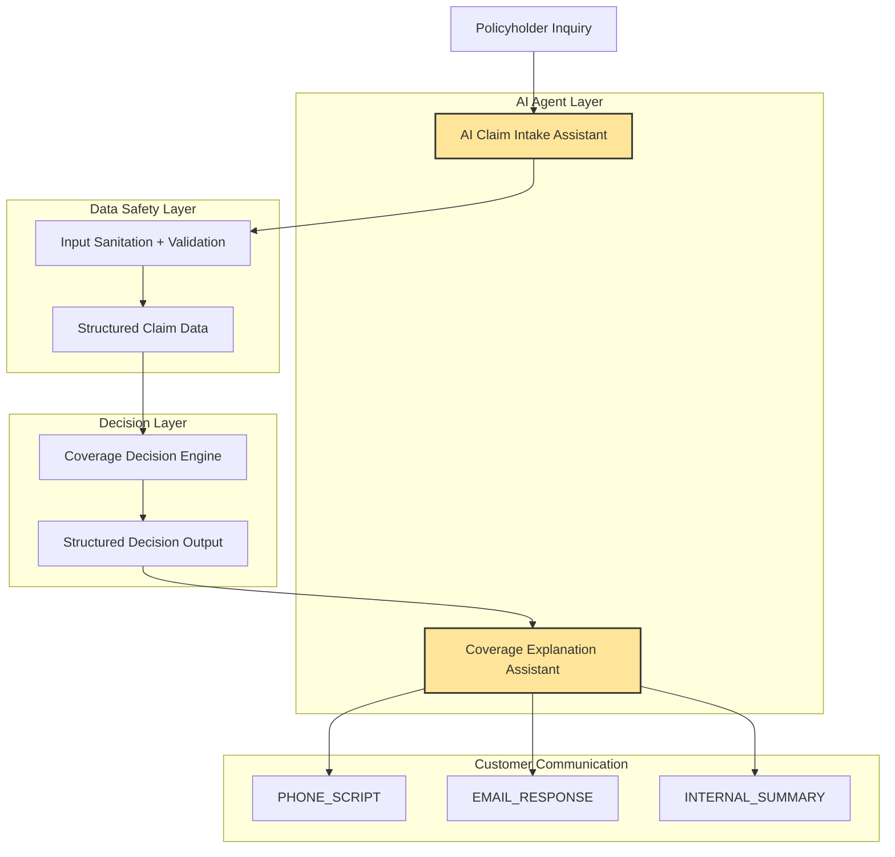

# 🛡️ Coverage Explanation Assistant
### A Constrained AI Communication Layer for Regulated Insurance Workflows
A reference architecture showing how to safely use AI to explain insurance coverage decisions without allowing the AI to reinterpret policy logic.

## How This Project Fits Into the AI Workflow

This repository is part of a two-agent AI workflow for handling insurance claim inquiries safely.

The system separates **data collection, sanitation, decision logic, and communication**.



## Project Scope

This repository demonstrates an **architecture pattern**, not a production claims system.

What this project **does** demonstrate:

- Safe AI communication layers for regulated decision systems
- Separation between decision engines and AI explanations
- Guardrail prompts and constrained AI outputs
- Stress testing for common AI failure modes
- Structured input schemas for AI systems

What this project **does NOT include**:

- A full insurance claims decision engine
- Real policy rule logic
- Production system integrations
- Live customer data

The goal is to illustrate **safe design patterns for integrating AI into regulated workflows**.
## System Architecture

```mermaid
flowchart TD

A[Policyholder Inquiry] --> B[Decision Engine]

B --> C[Structured Decision Output]

C --> D[Coverage Explanation Assistant]

D --> E[PHONE_SCRIPT]
D --> F[EMAIL_RESPONSE]
D --> G[INTERNAL_SUMMARY]

C -. internal data not exposed .-> H[(Fraud Flags / Risk Analytics)]

H -. blocked from communication layer .-> D

### Related Project

This system receives structured decision outputs generated after claim intake and validation by:

- AI Claim Intake Assistant → collects and sanitizes claim information before it reaches the decision engine.
